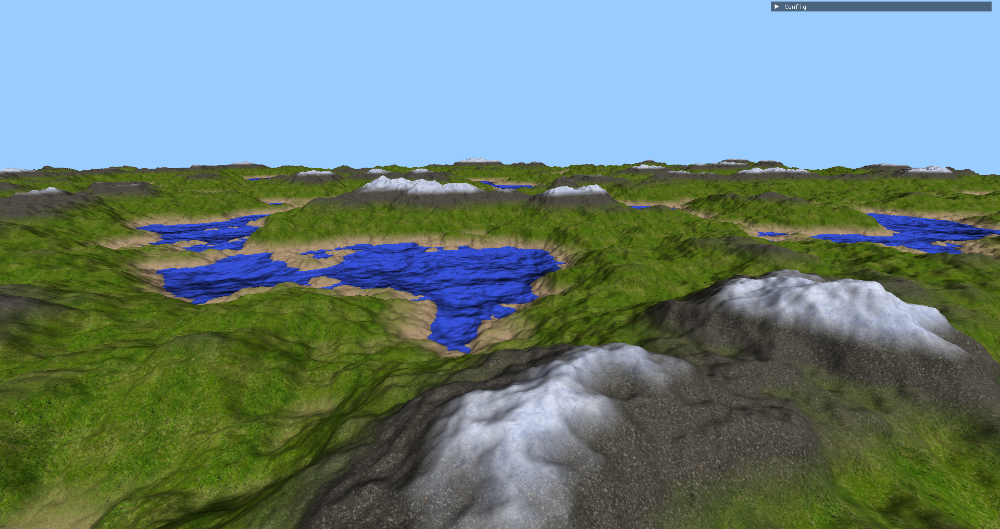
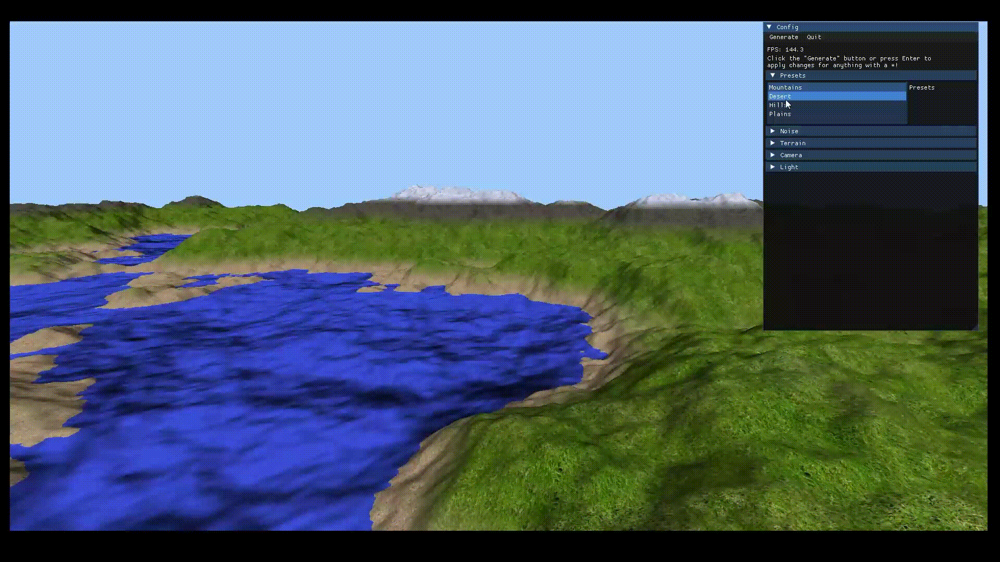

# Procedural Terrain Generator

## Preview

This project is a showcase of procedural terrain generation using OpenGL and C++. It features dynamic terrain creation, customizable variables through a GUI, terrain traversal, texture/color variation, and selectable biome presets.



### Video Demos

Multi-threaded infinite terrain generation speed, the chunk generation is sent off to a separate thread in order to allow the main thread to continue displaying the terrain. As you can see from the fps counter in the top right, the fps remains relatively stable for a large terrain.


Playing with the colors and textures:


Trying out different biome presets:


Changing the Perlin noise parameters:


## Controls

| Input  | Action                |
|------- | --------------------- |
| ESC    | Switches cursor mode  |
| E      | Toggle wireframe mode |
| W      | Move forward          |
| A      | Move left             |
| S      | Move backward         |
| D      | Move right            |
| SPACE  | Move up               |
| LCTRL  | Move down             |
| LSHIFT | Move faster           |

## Building

### Dependencies

- [CMake](https://cmake.org)
- [OpenGL](https://www.opengl.org)
- [GLFW](https://www.glfw.org)
- [GLM](https://github.com/g-truc/glm)
- [GLEW](http://glew.sourceforge.net)

### Building
```bash
mkdir build && cd build && cmake .. && make
```

### Running
```bash
./terrain
```

# Credits
- [ManyTextures](https://www.manytextures.com) for the textures. [license](http://creativecommons.org/licenses/by/4.0/)
